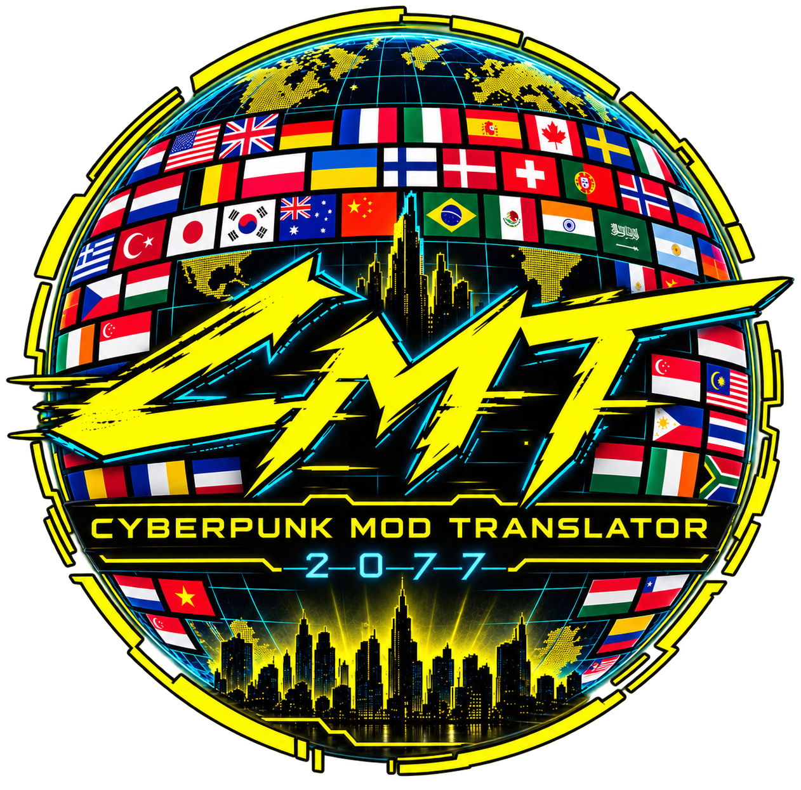
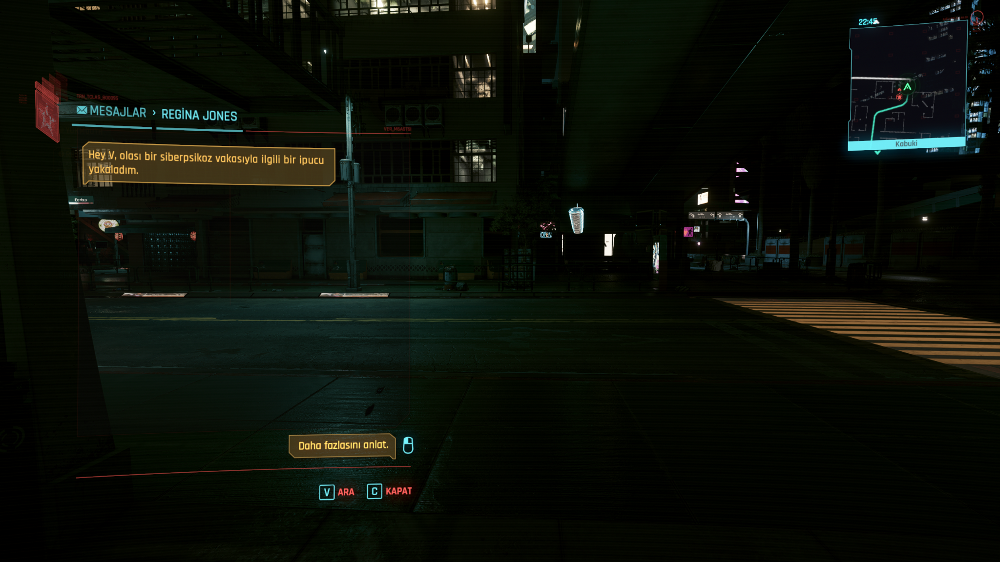
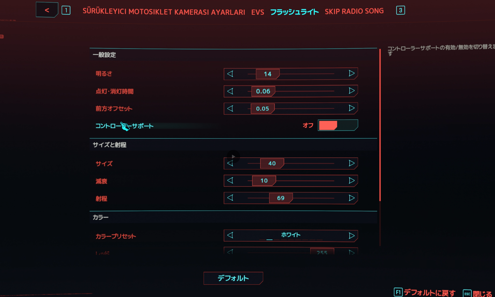
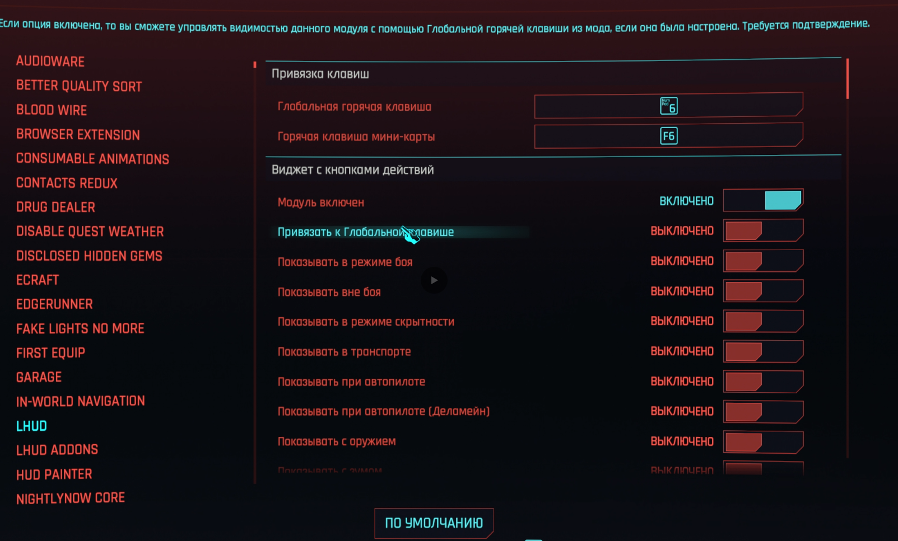
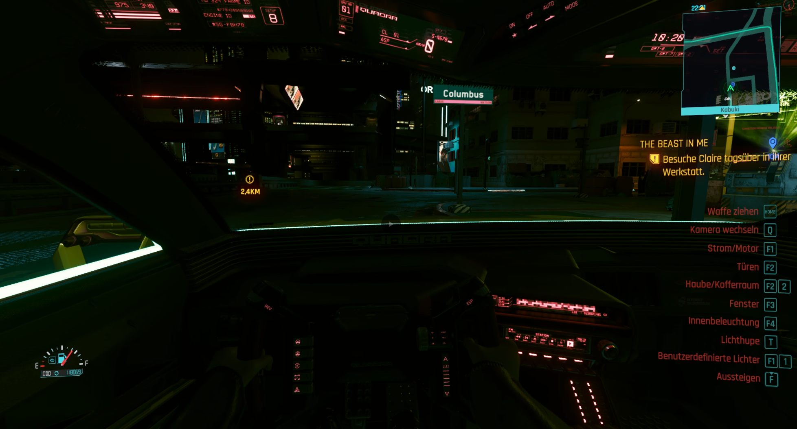
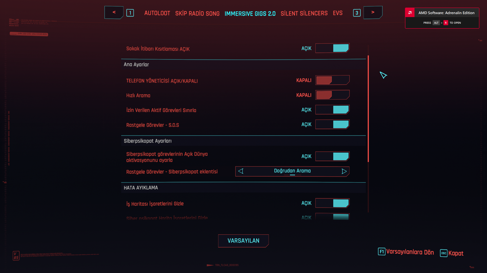
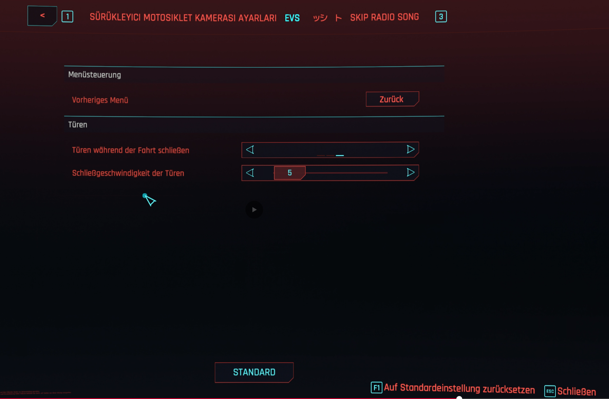

  

<h1 align="center">Cyberpunk Mod Translator</h1>

  AI-powered localization tool for Cyberpunk 2077 mods.

  
  
  
  
  
  

---

## What is this?

Cyberpunk Mod Translator automatically translates Cyberpunk 2077 mods into your chosen language using Google's Gemini AI.

Unlike generic translators, it understands Cyberpunk localization formats and safely processes mod localization resources while preserving runtime functionality.

---

## Features

- ArchiveXL localization support
- Codeware localization support
- Lua localization support
- Native Settings UI support
- Mod Settings support
- Automatic MO2-ready ZIP generation
- Batch translation with retry handling
- Preserves protected runtime scripts
- Multi-language support

---

## Supported Content

| Content | Supported |
|---------|-----------|
| ArchiveXL localization | ✅ |
| Codeware localization | ✅ |
| Lua localization | ✅ |
| Native Settings UI | ✅ |
| Mod Settings | ✅ |
| In-game messages | ✅ |
| MO2 output | ✅ |

---

## Before & After

### In-game Messages

---

### Native Settings UI Translation

Works with mods using Native Settings UI.

---

### Mod Settings Translation

Entire settings pages are translated.

---

### Complex In-game Settings

Supports larger multi-page configuration menus.

---

### Gameplay Mod Configuration

Even extensive gameplay mod settings are localized.

---

### Additional Settings Pages

---

## How it Works

1. Select a Cyberpunk mod ZIP.
2. Choose your target language.
3. Enter your Gemini API key.
4. Click **Start Translation**.
5. Receive a fully translated MO2-ready ZIP.

---

## Requirements

- Windows
- Cyberpunk 2077
- WolvenKit (included)
- Google Gemini API Key

---

## Roadmap

- [x] ArchiveXL support
- [x] Codeware support
- [x] Lua localization support
- [x] Native Settings UI support
- [x] Mod Settings support
- [x] Automatic MO2 ZIP export
- [ ] Review & Edit interface
- [ ] Drag & Drop support
- [ ] Additional localization formats

---

## Credits

- Google Gemini API
- WolvenKit
- CD Projekt RED modding community

---

## License

See `LICENSE-NOTICE.txt`.